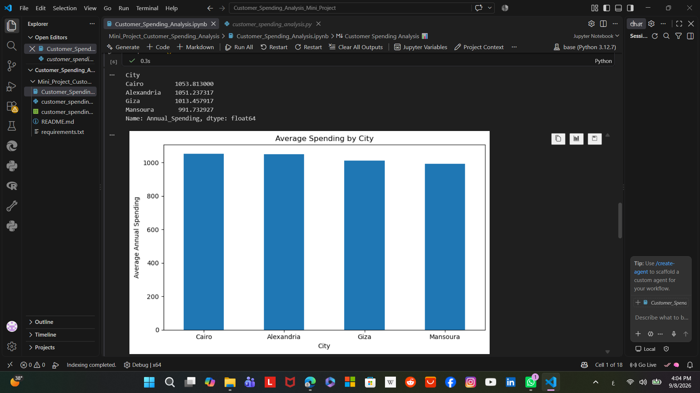
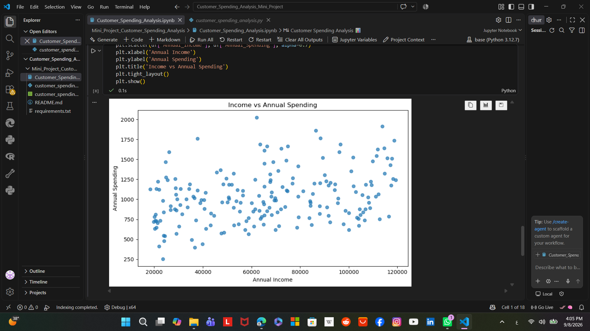

# Customer Spending Analysis 📊

A beginner-friendly **Data Science Mini Project** created as part of **Arabian Academy — PROVE IT — Day 03**.

## 🎯 Project Idea

The goal is to analyze customer behavior and understand which factors are related to annual customer spending.

The project demonstrates a complete small Data Science workflow:

**Load Data → Explore → Clean → Analyze → Visualize → Extract Insights**

## 📌 Questions

- How much do customers spend on average?
- Is annual income related to annual spending?
- Do customers who place more orders spend more?
- Which city has the highest average spending?
- How should missing values be handled?

## 🛠️ Technologies

- Python
- Pandas
- NumPy
- Matplotlib
- Jupyter Notebook / VS Code

## 📂 Project Structure

```text
customer-spending-analysis/
│
├── customer_spending.csv
├── customer_spending_analysis.py
├── README.md
└── requirements.txt
```

## 🔍 Data Preparation

The dataset contains customer information such as:

- Age
- Gender
- City
- Annual Income
- Website Visits
- Orders
- Satisfaction Score
- Annual Spending

A few missing values were intentionally included to demonstrate data cleaning.

### Missing Values

- Numeric columns → filled with the **median**
- Categorical columns → filled with the **mode**

## 📊 Analysis

The project includes:

1. Dataset inspection
2. Missing-value detection
3. Data cleaning
4. Descriptive statistics
5. Feature creation
6. Grouping by city
7. Correlation analysis
8. Data visualization
9. Business-style insights

## ▶️ How to Run

Install the required libraries:

```bash
pip install -r requirements.txt
```

Then run:

```bash
python customer_spending_analysis.py
```

Or open the Python file in VS Code / Jupyter-compatible environment.

## 💡 Key Learning Outcomes

Through this project, I practiced:

- Data loading with Pandas
- Data cleaning
- Handling missing values
- Descriptive statistics
- GroupBy analysis
- Correlation analysis
- Data visualization
- Turning data into understandable insights

## 🚀 Future Improvements

Possible next steps:

- Add outlier detection using IQR
- Build an interactive Power BI dashboard
- Apply a machine learning model to predict spending
- Add more customer features
- Compare different preprocessing techniques
## 📊 Visualizations

### Income vs Annual Spending

This chart shows the relationship between customers' annual income and their annual spending.



### Average Spending by City

This chart compares the average annual spending across different cities.


## 👩‍💻 Author

**Hamsa Adel**

This project was created for the **Arabian Academy — PROVE IT — Day 03** mini project.
